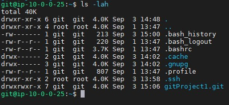
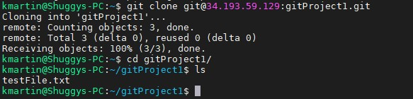
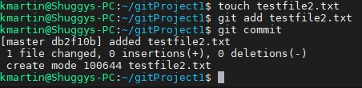
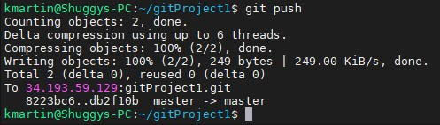
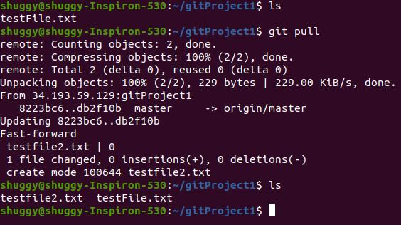

#Project 1  
Kevin Martin  
9/3/2021  

1. First I created a new user on my ubuntu server using the command $useradd git. 
2. Then I created a .ssh folder for the git user using the command $mkdir .ssh  
3. Then I created a new file called authorized_keys which will be used to store the public key from my local machine. 
4. Then on my local machine I created a new public private key pair using the command $ssh-keygen -t ed25519 -C "martin.670@wright.edu".
5. I then copied the public key that I generated and pasted it into the authorized_keys file for my git user on my ubuntu machine. 
6. I then created a new git repository using my git user on my ubuntu machine with the command $git init --bare gitProject1.git This command created a empty git repository.  

7. Next on my local machine I used the command $git clone git@34.193.59.129:gitProject1.git 

8. I then tested the git repository by creating a file, adding it to the commit, and then commiting. 

9. I then pushed the commit.  

10. Next, to test that the commit went through on my other machine where I also have the gitProject1.git repository cloned I used a git pull command to update the repository to the newest commit  

