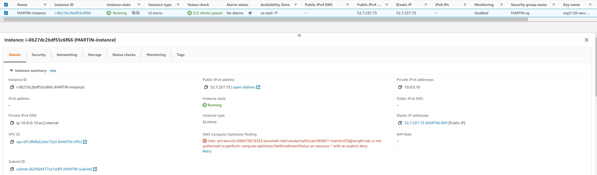

# Project 3

## Part 1
  - 1.) Create VPC
    
    - The vpc or virtual private cloud is the container for our cloud and is what all other parts created run in.
    
  - 2.) Create Subnet
    
    - Subnets are the range of IP address inside your VPC here we used 10.0.0.0/28 for our subnet. 
    
  - 3.) Create gateway
    
    - This internet gateway is used by the vpc to connect to the outside world and it is attached to our vpc that we created earlier.
  
  - 4.) Create Route Table
    
    
    - This route table is used to direct the network traffic for our vpc. I added a rule that allows traffic to and from the internet from our vpc and also associated it with our subnet. 
  
  - 5.) Create Security group
    
    - The security group is how we configure our network firewall for our vpc. For this example I configured my IP at home, wright states IP, and also all address inside the vpc.
    
  - 6.) Key Pair
    - I used my already created key pair with aws for this project. 

## Part 2
  - 1.) 
    - I chose the ubuntu sever 20.04 LTS AMI for this project because it is in the free tier 
      - The default username for this AMI is ubuntu
    - For the instance type I chose t2.micro for the same reasons as above  
  - 2.) 
    - I attached  the instance to the VPC using step three of the instance creation menu when selting the network.
  - 3.) 
    - I did not auto assign  a public IPV4 because I had already allocated an elastic ip that i wanted to use for this instance. 
  - 4.) 
    - I attached the default volume for this tier which is one GB of memory and this was done in step 4 of the instance set up menu.
  - 5.) 
    - I then attached the tag name MARTIN-instance in step 5 of the instance set up menu. 
  - 6.) 
    - I next on step 6 chose to use an existing security group and chose the one I created earlier for this instance. 
  - 7.) 
    - Next for the elastic IP I went to the VPC menu and selected elastic IPs and allocated one for my instance using the defaults.
    - Then I selected the newly created IP and went to the actions menu and then clicked assocate elastic IP address and chose my newly created instance. 
  - 8.) 
  
  - 9.) 
    - To change the hostname file I used the command $ sudo hostname MARTIN-ubuntu and that changed the hostname 
  - 10.) 
  
  
  
