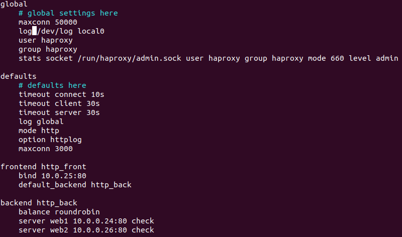
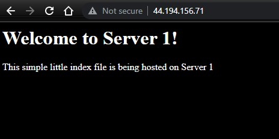
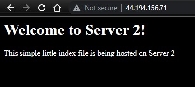

- 1.)
  - The host file for the proxy server needs two lines added to it so the so webserver1 and webserver2 are known as web1 and web2.
    - 10.0.0.24 web1
    - 10.0.0.26 web2
  - For the web servers I also configured there host files replacing one web server with the proxy host.
    - 10.0.0.25 proxy
- 2.)
  - To ssh between the systems you need to get the key you use for aws onto the servers because  that is the way ssh is verified. 
  - I did this by using sftp to transfer the key from my local machine  to the proxy server using this command:
    - sftp -i keyname.pem ubuntu@proxyipaddress
  - Once this was done I used the put command to put the key on the proxy server. 
  - Then on the proxy server I used the ssh command to connect to the web servers using there private ip and the key to verify. 
- 3.)
  - HAProxy is installed on the proxy server when it is created via the cloud formation script using the commands in the userdata section of script:
    -  UserData:
        Fn::Base64:
          !Sub |
            #!/bin/bash -xe
            apt-get update && \
            apt-get install -y git python3 python3-pip haproxy && \
            hostnamectl set-hostname proxy && \
            reboot
  - These commands install python3 and haproxy and also change the hostname to proxy
  - Then I modified the haproxy file with the following configuration
  
  - Then once the configuration file changed I used the command:
    - $ sudo systemctl restart haproxy
  - Then to check the status of HAProxy I used the command:
    - sudo systemctl status haproxy
  - I used this digital ocean article when configuring HAProxy:
    - https://www.digitalocean.com/community/tutorial_series/common-haproxy-errors
- 4.)
  - For the two web servers in this project the following commands were used in the userdata section of the creation script:
    - UserData:
        Fn::Base64:
          !Sub |
            #!/bin/bash -xe
            apt-get update && \
            apt-get install -y git apache2 && \
            hostnamectl set-hostname web1 && \
            reboot
  - These commands install git and apache2 and also change the host name to web1 and web2 respectfully
  - I then swapped the default index.html file for apache in the var/www/html directory with the web pages supplied for the project by using following commands on both web servers: 
    - sudo rm index.html
    - sudo wget https://raw.githubusercontent.com/pattonsgirl/Fall2021-CEG3120/main/Projects/Project5/index.srv1.html
    - sudo mv index.srv1.html index.html
  - No further configuration settings were needed for the servers to display these webpages.
  - I used this configuration guide from digital ocean though it is intended for a site using php and mysql it still gives a good guide on apache config.
    - https://www.digitalocean.com/community/tutorials/how-to-install-linux-apache-mysql-php-lamp-stack-on-ubuntu-20-04
- 5.)
  - 
  - 
- 6.) 
  - proxy link http://44.194.156.71/
